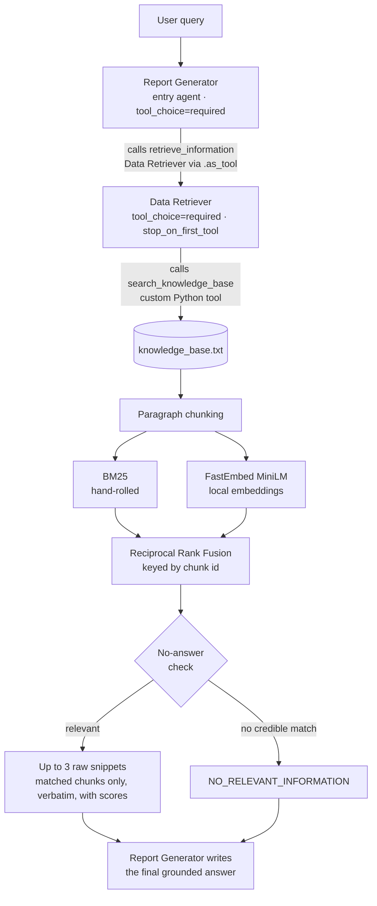
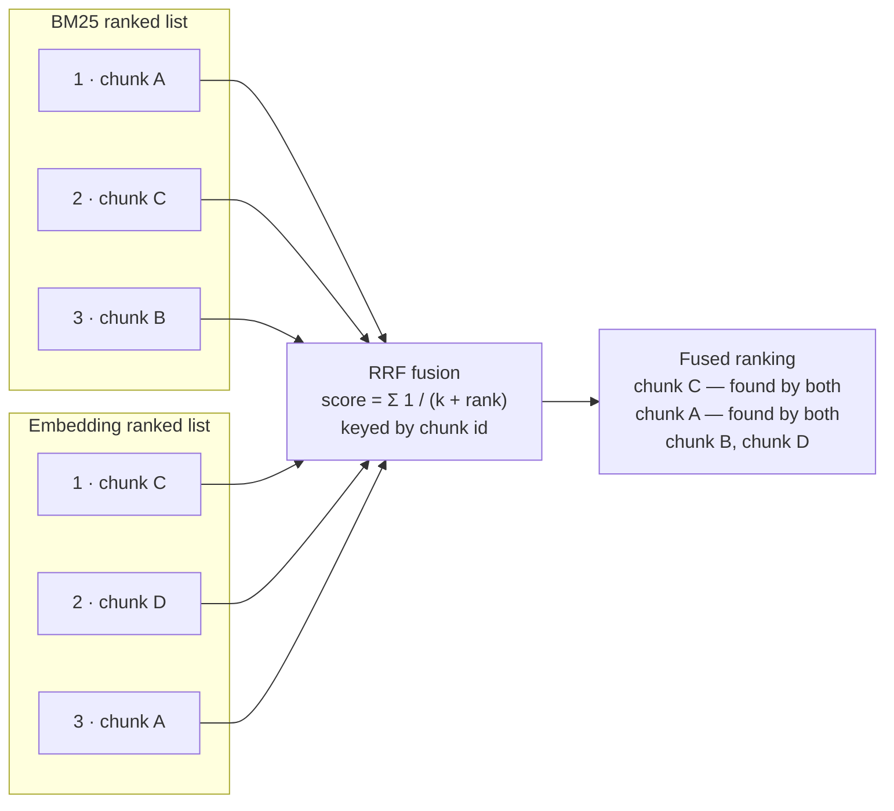

# Agentic AI with RAG — BBL AI Engineer Programming Test

A two-agent system built with the **OpenAI Agents SDK**: a **Data Retriever** agent
performs Retrieval-Augmented Generation over a local knowledge base
(`knowledge_base.txt`, fictional company policies), and a **Report Generator**
agent synthesizes the retrieved snippets into a grounded, non-redundant answer.

## Architecture



## Setup

```bash
python -m venv .venv && source .venv/bin/activate   # Windows: .venv\Scripts\activate
pip install -r requirements.txt
cp .env.example .env                                # then fill in your key(s)
```

`.env` supports two providers (set `LLM_PROVIDER`):

| Provider | What you need |
|---|---|
| `bbl` | The gpt-5-mini key for BBL's Azure APIM gateway (`BBL_API_KEY`) |
| `openai` | A standard OpenAI API key (`OPENAI_API_KEY`) |

> The first run downloads the MiniLM embedding model (~80 MB). If the download
> is not possible, the system logs a warning and degrades gracefully to
> BM25-only retrieval.

## Run

```bash
python main.py "What is the policy on international travel?"   # single query
python main.py                                                 # interactive loop
pytest tests/ -v                                               # offline tests, no API key needed
python run_samples.py                                          # whole sample suite -> samples_output.md
```

Sample queries used for the screenshots in `screenshots/`:

1. `What is the policy on international travel?` — exact keyword match
2. `What are the rules for an overseas business trip?` — paraphrase (semantic side)
3. `How do I claim expenses for a hotel on a domestic trip?` — multi-policy synthesis
4. `Who won the World Cup in 2022?` — out-of-KB → the system says so instead of guessing
5. `When should corporate card receipts be uploaded?` — new policy exact match
6. `Can I send customer account numbers to a personal email account?` — data privacy boundary
7. `What should I do if I lose a company laptop or security token?` — cross-policy retrieval
8. `Before we sign a new technology vendor and issue a purchase order, do we need quotes or due diligence?` — noisy cross-policy retrieval
9. `What is the parking policy for employees at headquarters?` — policy-sounding near miss → no answer

## Design decisions (and trade-offs)

**Agent-as-tool over handoff.** The Report Generator must always own the final,
user-facing answer, so it is the entry agent and the Data Retriever is a bounded
sub-task attached via `.as_tool()`. A handoff would transfer the conversation
*to* the receiving agent — backwards for this data flow. A plain deterministic
pipeline (run retriever, pass output to generator in Python) was also considered:
simpler, but it demonstrates less of the SDK's orchestration model.

**Forced tool use, verbatim snippets.** Both agents set
`ModelSettings(tool_choice="required")`, so neither can skip retrieval and
answer from parametric memory. The Data Retriever additionally uses
`tool_use_behavior="stop_on_first_tool"`: the custom tool's output *is* the
agent's output — raw chunks are returned verbatim (as the brief requires),
the LLM cannot paraphrase them, and one model round-trip is saved per query.

**Hybrid retrieval (BM25 + local embeddings + RRF).** Keyword-only search
misses paraphrases ("overseas trip" never matches "international travel");
embeddings-only search can miss exact terms. Reciprocal Rank Fusion combines
both *by rank*, avoiding brittle score normalization between BM25 scores and
cosine similarities. Fusion is keyed by chunk id, so deduplication is implicit —
a chunk found by both retrievers simply accumulates both rank contributions.
BM25 is hand-rolled (~30 lines, zero dependencies) rather than imported, per
the brief's "custom Python function/tool" requirement. Embeddings run locally
via FastEmbed (ONNX, no torch) because (a) the BBL gateway exposes only an LLM
endpoint, no embeddings API, and (b) it keeps retrieval free, offline, and
deterministic.



*A chunk retrieved by both methods (C and A above) accumulates both rank
contributions, so it naturally rises to the top — and because fusion is keyed
by chunk id, deduplication is implicit rather than a separate step.*

**Filter before slicing to top-k.** RRF assigns a rank to *every* chunk, so
taking the top 3 of the fused ranking pads the result with chunks that neither
retriever actually matched — a query like `password length` would return the
one relevant policy plus two arbitrary fillers, diluting the generator's
context. Chunks must carry a real signal (non-zero BM25, or cosine above the
floor) to survive; `top_k` is therefore a ceiling, not a quota, and a narrow
query legitimately returns one snippet.

**No-answer check.** Top-k retrieval always returns *something*, even for
irrelevant queries. Two defenses: (1) in the tool — BM25 must have a credible
lexical match, not just one generic overlapping word in a noisy query, or the
semantic score must clear the 0.25 cosine threshold; otherwise the tool returns
`NO_RELEVANT_INFORMATION` instead of noise; (2) in the prompt — the Report
Generator is instructed to say the knowledge base doesn't cover the question
rather than guess. The instruction layer catches borderline cases the threshold
misses.

## Known limitations

- The knowledge base is small enough to fit in a single prompt; RAG is
  technically unnecessary at this scale and is implemented to satisfy the brief.
- **The cosine floor cannot separate relevant from irrelevant chunks, and no
  single value would.** `MIN_COSINE = 0.25` is empirical and model-specific.
  Measuring MiniLM cosines across the 13 sample queries (`samples_output.md`):

  | | Cosine range |
  |---|---|
  | Correct top-ranked chunk | 0.340 – 0.687 |
  | Irrelevant filler chunk | 0.193 – 0.474 |

  The distributions overlap between 0.340 and 0.474 — the correct answer for
  the domestic-hotel query scored 0.340, while an irrelevant chunk retrieved
  for the parking query scored 0.474. Any global cutoff that removes the noise
  also removes real answers. Nor can the tool simply require a non-zero BM25
  score, because the paraphrase query ("overseas work journey") finds its
  correct chunk at `bm25=0.00 cosine=0.574` — semantics alone, which is the
  entire reason the embedding side exists.

  Consequence: the match filter below trims padding reliably on the BM25-only
  path, but with embeddings enabled most chunks clear 0.25 and the top-k
  ceiling is usually reached anyway. The Report Generator's prompt is what
  actually suppresses the surplus snippets in the final answer. A *relative*
  threshold (keep chunks within ~60% of the best cosine for that query) would
  help — it fixes the parking and prompt-injection cases but not the
  paraphrase case — so it is an improvement, not a fix. Properly solving this
  needs a cross-encoder reranker or a calibrated relevance model, which is out
  of scope here.
- The tokenizer is naive (lowercase + punctuation strip + small English
  stopword list + light plural stemming); no full stemming, no synonym
  expansion, English-only.
- Knowledge-base text is inserted into the LLM prompt, so a hostile knowledge
  base could attempt prompt injection; content here is trusted, but production
  use would need sanitization.

## Security notes

- Keys live only in `.env` (gitignored); `.env.example` documents the shape.
- The retrieval tool reads one fixed file path — no user-supplied paths.
- Tracing is disabled (`set_tracing_disabled(True)`) so no data is exported
  to the OpenAI traces dashboard.
